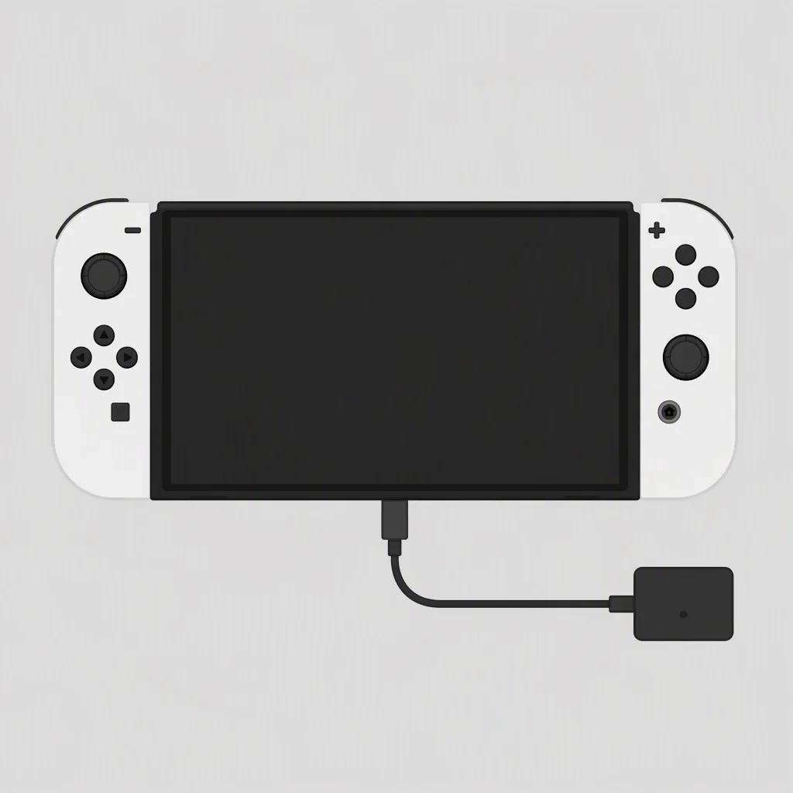
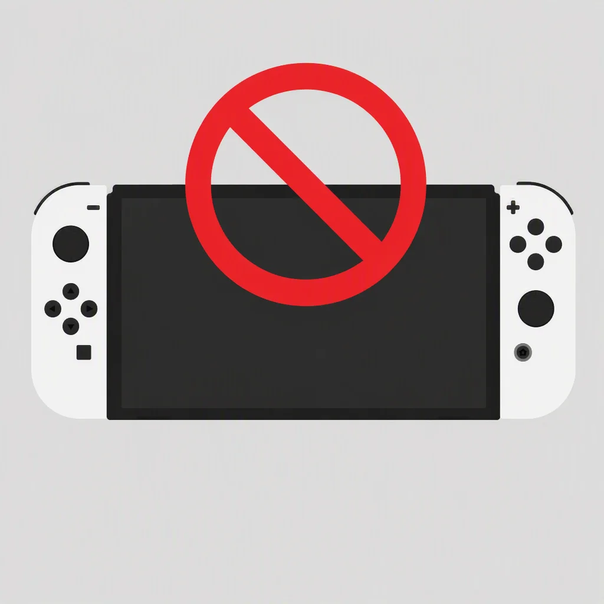
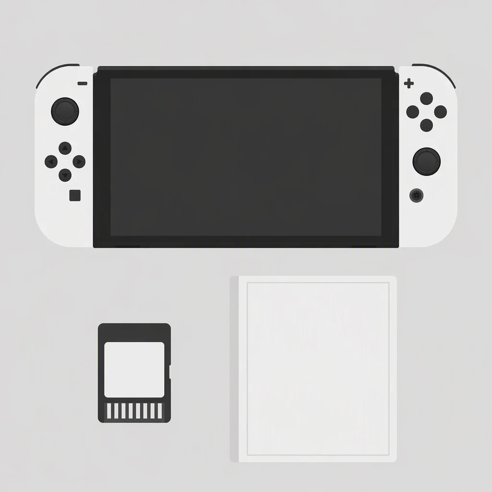

> 本文最后更新日期：2026-08-29

**放在前面的话：胖黄鸭不推荐任何形式的 Switch 破解，本文仅作科普与风险提示，帮你在看到「软破」「硬破」这类词时不被忽悠。** 破解看起来是「免费玩游戏」，但背后的封号、变砖、失去联机乐趣等代价，往往远超省下的那点钱。

---

## 🔓 Switch 破解是什么？

所谓「破解」，指的是利用硬件或系统漏洞，绕过任天堂官方的启动与验证机制，在机器上运行自制系统（Custom Firmware，简称 CFW），从而安装非官方渠道的游戏。

破解的「成果」只有一个：**跳过正版购买，直接运行盗版游戏**。代价却有很多，我们放在后面细说。

---

## 🧰 主要的破解方式

Switch 一代（初代 / 续航版 / OLED / Lite）的破解，大致分成两种路线：

### 软破（软件破解）

只适用于**早期初代机型**（约 2018 年 6 月前生产、可查序列号确认的那一批）。它利用的是初代搭载的 **Nvidia Tegra X1（T210）芯片 boot ROM 里的 RCM 漏洞**：

- 通过短接器把 Joy-Con 接口的特定引脚短路，再按住音量 + 开机，让机器进入 RCM 恢复模式；
- 用电脑或注入器（如 TegraRcmGUI）注入一个 payload（通常是 Hekate 引导程序）；
- 引导进入自制系统（最主流的是 **大气层 Atmosphere**）。

软破的优点是**不用拆机**、可逆（删除虚拟系统后能恢复原机）。缺点是每次彻底关机后都要重新短接 + 注入，比较麻烦；而且能软破的机器如今都已停产多年，存量越来越少。

### 硬破（硬件破解）

初代的 RCM 漏洞被发现后，任天堂在后续机型（续航版、OLED、Lite）换用了修复该漏洞的 **Mariko（T214）芯片**，软破失效。于是出现了「硬破」：

- 拆开主机，在芯片旁**焊接一块破解芯片**（早期是国产芯片，后来流行树莓派方案）；
- 芯片在通电时向 CPU 发送干扰脉冲，强行让机器进入 RCM，从而加载自制系统。

硬破的好处是**开机自动引导、无需每次注入**，且所有一代型号都能做。缺点是**必须拆机焊接**，门槛高、有焊坏甚至报废的风险，普通人基本只能找商家代劳。

无论软破还是硬破，最终都运行在大气层（Atmosphere）系统 + Hekate 引导下，很多还会做「双系统 / 虚拟系统（emuNAND）」来把破解区和官方区隔开。

:::caution[⚠️ 注意]
以上只是原理科普，**不是教程**。胖黄鸭不提供、也不建议你去折腾这些——继续往下看你就知道为什么了。
:::

---

## ⚠️ 再强调一次：我不推荐破解

在讲「为什么破解的人越来越少」之前，必须把破解的真实代价摆清楚。破解不是「白嫖福利」，而是一笔很可能亏本的买卖：

- 🚫 **封号 / 变砖风险**：只要破解机联网，任天堂就能识别并封禁（ban），你的账号和机器可能永久失去 eShop、联机和云存档功能。任天堂近年来不断升级账号条款，2026 年的最新条款里，违规甚至可能导致主机「变砖」。
- 🎮 **失去 Switch 最大的乐趣**：联机对战、马车 / 大乱斗 / 喷射战士 / 动森等游戏的精髓全在联网，破解机等于自断一臂。
- 🛡️ **失去官方服务**：无法正常更新系统、无法上 eShop、买不了 DLC，遇到新游戏还得等破解团队跟进。
- 🔧 **维护成本高**：大气层、Hekate 要跟着官方系统更新频繁升级，小白很容易在折腾中出错。
- ⚖️ **法律与道德风险**：破解、传播盗版在全球多数地区违法，任天堂也已起诉并判刑了多起破解产业链的核心成员。

省下的是几百块游戏钱，搭进去的是一台机器的完整体验，这笔账真的不划算。

---

## 📉 为什么以前破解的人多，现在越来越少了？

如果你在 2019 年前后关注过 Switch，会发现当时「破解」话题很热闹，现在却明显冷清。原因主要有这几个：

1. **软破漏洞被封死，能破的机器没了**。初代的 RCM 软破漏洞在 2018 年年中就被修复，后续机型只能走拆机焊接的硬破路线。而能软破的初代机器，至今已投产 7 年有余，早已停产，存量机器也陆续步入报废期——「无米下锅」是最直接的原因。

2. **硬破门槛高、风险大**。拆机焊接不是普通玩家敢碰的，焊坏就报废，还得找商家花手工费。这条路线劝退了绝大多数只想「顺手玩玩」的人。

3. **封号代价越来越重**。任天堂的封禁机制日益完善，从封账号、封机器到最新的「可能变砖」，风险门槛一年比一年高，愿意赌的人自然越来越少。

4. **联网时代，破解机失去了大半价值**。现在的 Switch 游戏高度依赖联网——联机对战、更新补丁、DLC、云存档。破解机一联网就面临封号，等于把主机「阉割」成一台离线单机，很多人算了算账就不折腾了。

5. **正版获取成本在下降**。eShop 数字版常年打折，实体卡带二手流通成熟、玩完还能回血。当正版的「价格痛点」没那么痛时，破解的动机也就弱了。

6. **任天堂打击力度升级**。从起诉 Team Xecuter 核心成员并判刑，到账号条款收紧，官方对破解生态的持续围剿，让破解的供给（芯片、教程、团队）也在萎缩。

---

## ✅ 最后：支持正版，才是对游戏最好的支持

破解看似「省钱」，实则是用一台机器的完整体验、账号安全和联机乐趣，去换短暂的免费快感，长远看往往是亏的。胖黄鸭作为游戏机选购指南，**始终反对任何形式的破解**，也提醒主人们：购买二手或低价机器时，务必留意对方是否动了手脚、是否为破解机，避免买到「黑机」被连带封禁。

如果你只是担心正版游戏太贵，其实有大量合法又省钱的玩法——蹲 eShop 打折、买二手卡带再出掉回血、和好友合购家庭会员等，都能大幅降低成本，还能完整享受联机乐趣。

**支持正版，才能真正支持你喜欢的游戏和厂商。** 这也是胖黄鸭一直以来的立场。

---

:::tip[💡 相关阅读]
想正常入手一台 Switch？先看看 [Nintendo Switch 1 选购指南](/switch/gen-1/guide/)，把四型号区别、优缺点和购买建议一次搞清楚。
:::
