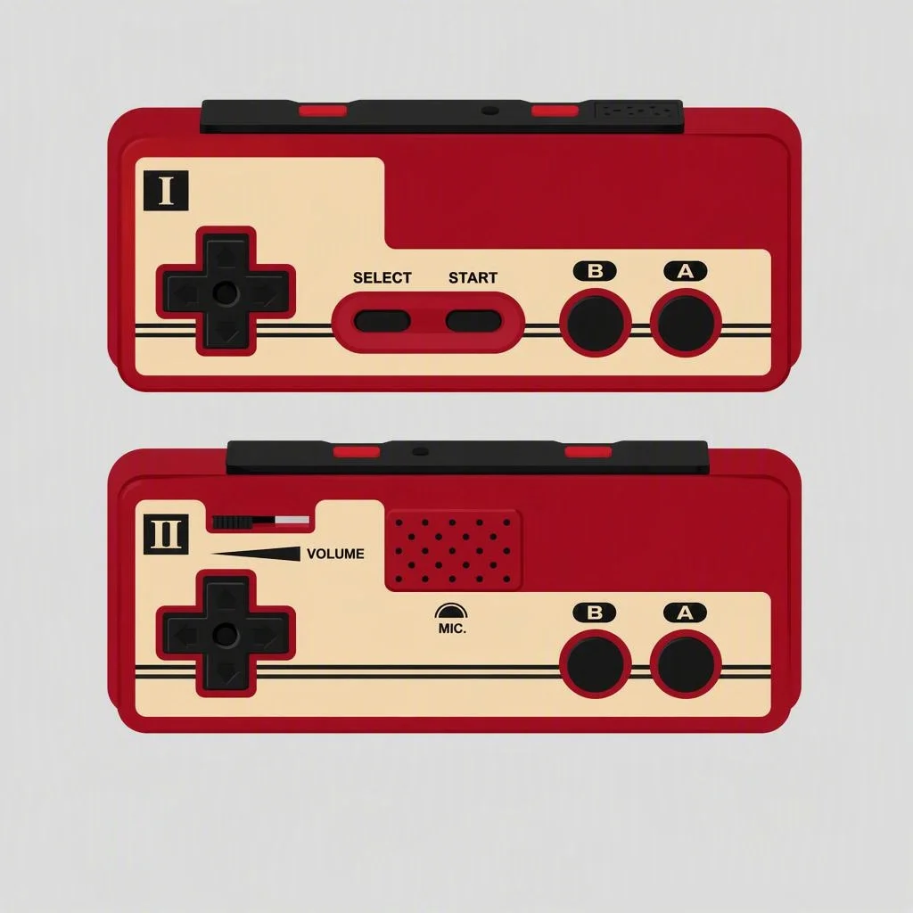
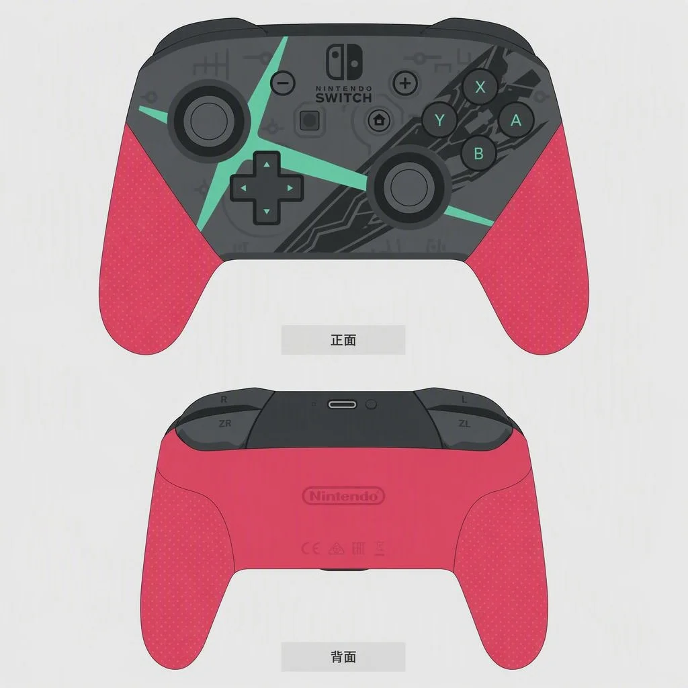
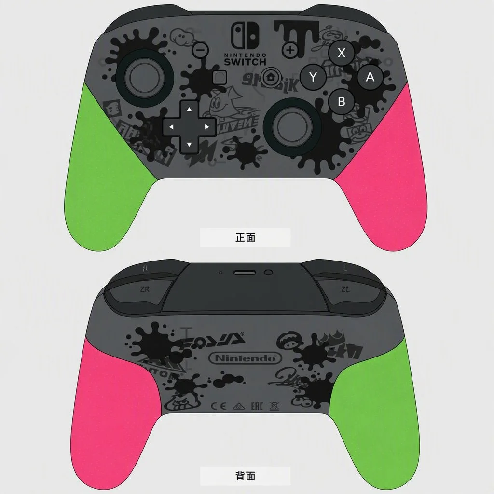
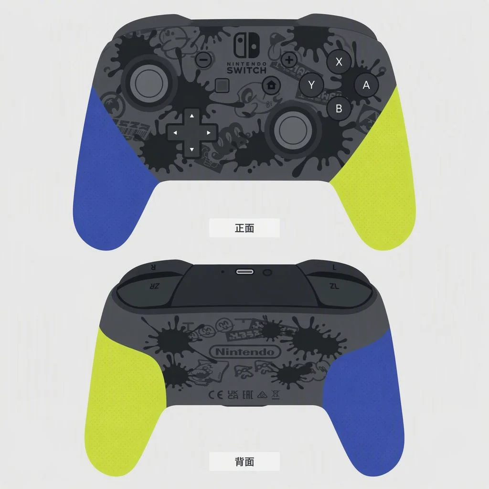
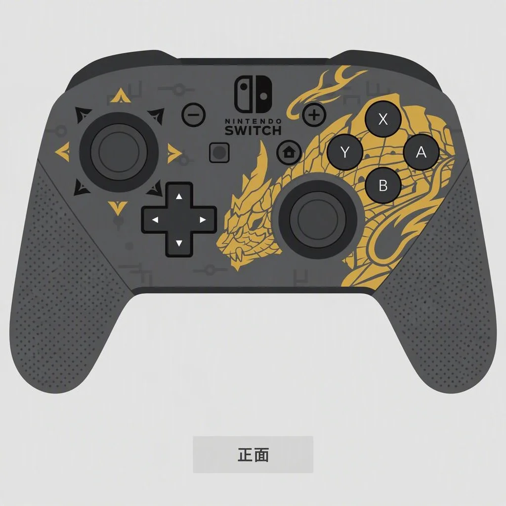
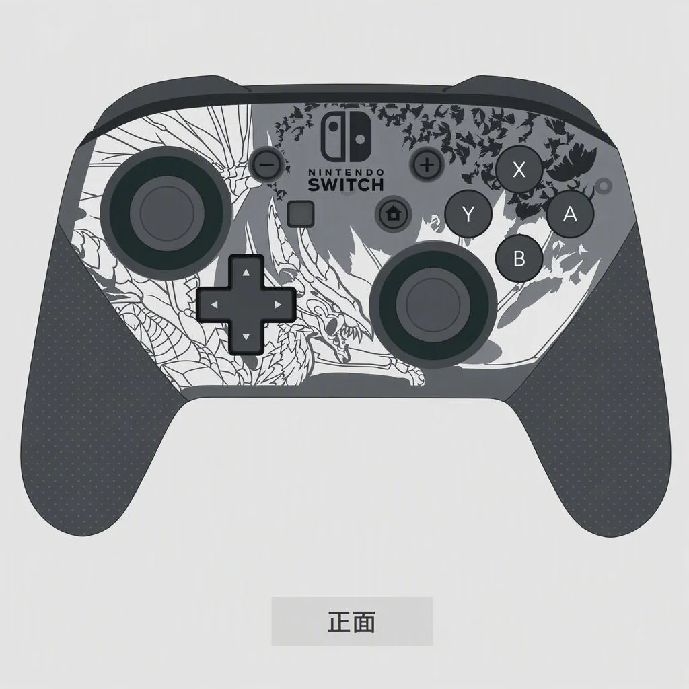
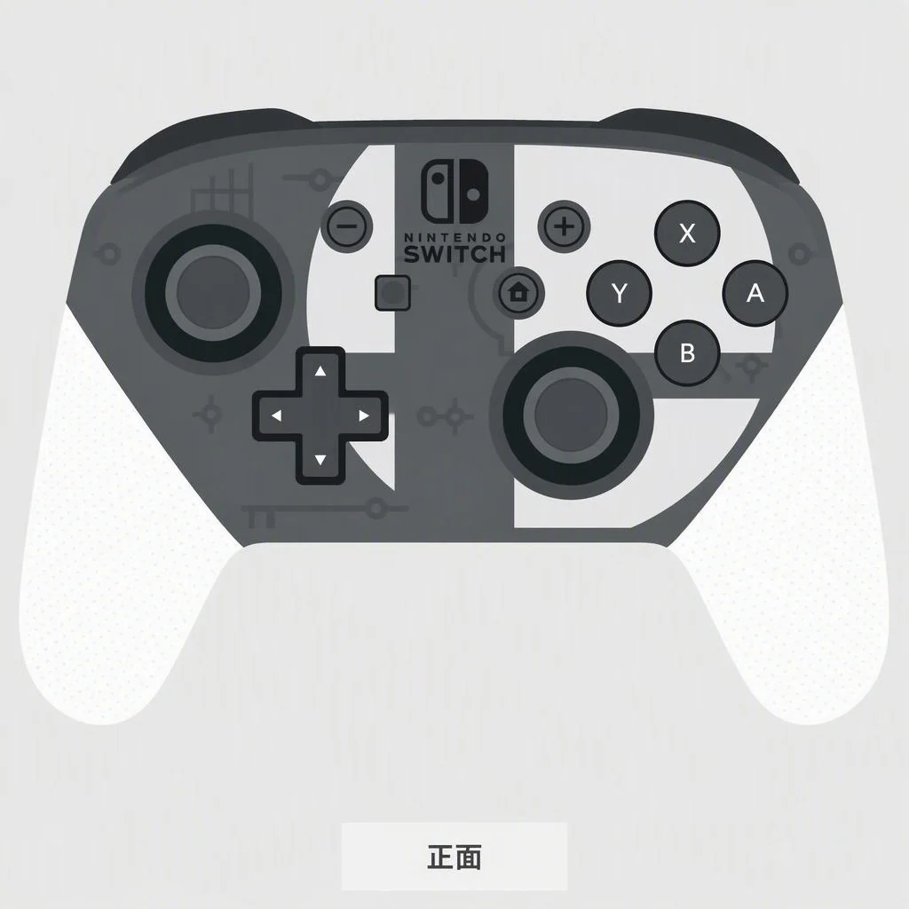
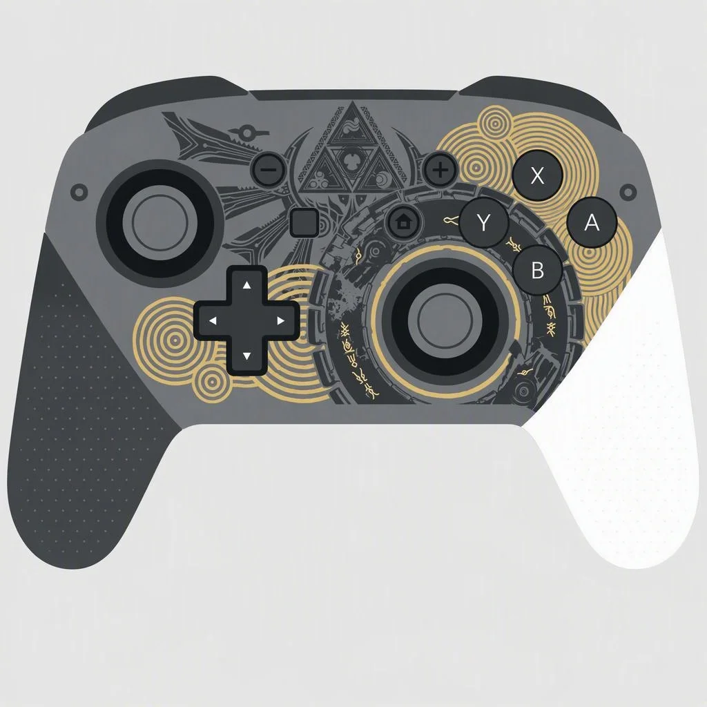
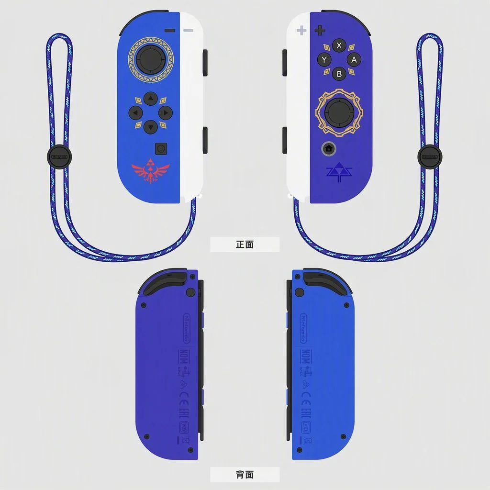

> 本文最后更新日期：2026-08-05

除了限定主机，任天堂还为 Switch 一代推出了多款限定 Pro 手柄和 Joy-Con。本文整理了一代生命周期内的主要限定手柄。

---

## 🎮 FC 经典复刻手柄

完美复刻了一代经典红白机（Famicom）的手柄造型，情怀拉满。按官方设定，只有 **Nintendo Switch Online 会员** 可以在任天堂官网预购。由于发售渠道有限，国内入手有一定门槛。

---

## ⚔️ 异度之刃 2 限定手柄

《异度之刃 2》联名限定 Pro 手柄。深红色主体 + 金色焰纹图案，本人最喜欢的一款。可惜出来的时候笔者口袋里没有钱，等攒够钱已经停产了 😢。目前市面上还能搜到，但怕是仿品，一直没再购入过。

---

## 🦑 Splatoon 2 联名手柄

《Splatoon 2》联名 Pro 手柄。可爱的绿粉拼色握把，上面的墨水痕迹配上半透明的壳子，非常可爱。是 Splatoon 系列的初代限定手柄。

---

## 🦑 Splatoon 3 联名手柄

《Splatoon 3》联名 Pro 手柄。继承了 2 代手柄的设计理念，使用了全新的配色和潮牌风格图案。渐变色的握把比 2 代更有层次感。

---

## 🐲 怪物猎人 崛起限定手柄

《怪物猎人 崛起》联名 Pro 手柄。金色图案通过转印工艺覆盖在黑色手柄上，整体质感尚可。但由于发售时间较晚，被玩家戏称为"老任清库存"之作。

---

## 🐲 怪物猎人 曙光限定手柄

《怪物猎人 崛起：曙光》联名 Pro 手柄。比崛起的版本看着良心了一些，图案面积更大、设计更精致，但依然有清理黑色手柄库存的嫌疑 🤔。

---

## 💥 任天堂明星大乱斗 特别版手柄

《任天堂明星大乱斗 特别版》联名 Pro 手柄。白色握把 + 大乱斗 Logo 设计简洁大方，但白色部分容易留下划痕和掉漆。笔者当年不小心蹭了一下，心疼了好久。

---

## 🟢 塞尔达传说 王国之泪限定手柄

《塞尔达传说：王国之泪》联名 Pro 手柄。非常漂亮的设计——深色主体搭配淡金色纹理，奢华但不张扬。和王国之泪 OLED 限定机是绝配。

---

## 🗡️ 天空之剑限定 Joy-Con

Joy-Con 颜色本来就很多，就不一一列举了。如果有机会去任天堂官方店，还有自由配对手柄颜色的特别服务。着重介绍一下这对《塞尔达传说：天空之剑 HD》限定 Joy-Con——**腕绳非常漂亮**，深蓝 + 金色纹饰，买来后一直不舍得用。

---

:::tip[💡 选购提醒]
限定 Pro 手柄的仿品比限定主机更泛滥。尤其是异度之刃 2 和大乱斗款，二手市场上高仿很多。建议通过序列号验证、HD 震动测试等方式鉴别真伪。
:::
