> 本文最后更新日期：2026-08-05

OLED 版作为一代机的最终旗舰，在生命周期内推出了多款限定主机。本文收录了 OLED 型号全部的限定款，供收藏参考。

---

## 🔴🔵 红蓝经典款

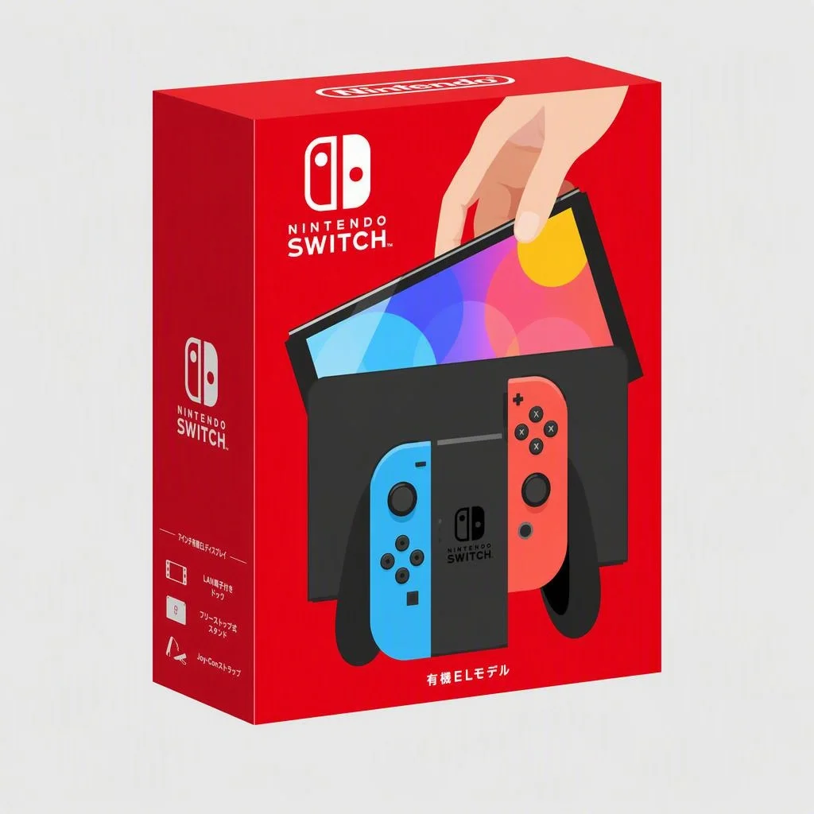

OLED 版的标准配色之一，和初代经典红蓝一脉相承。如果你喜欢经典配色但想要 OLED 的大屏体验，这款是不二之选。

---

## ⚪ 白色经典款

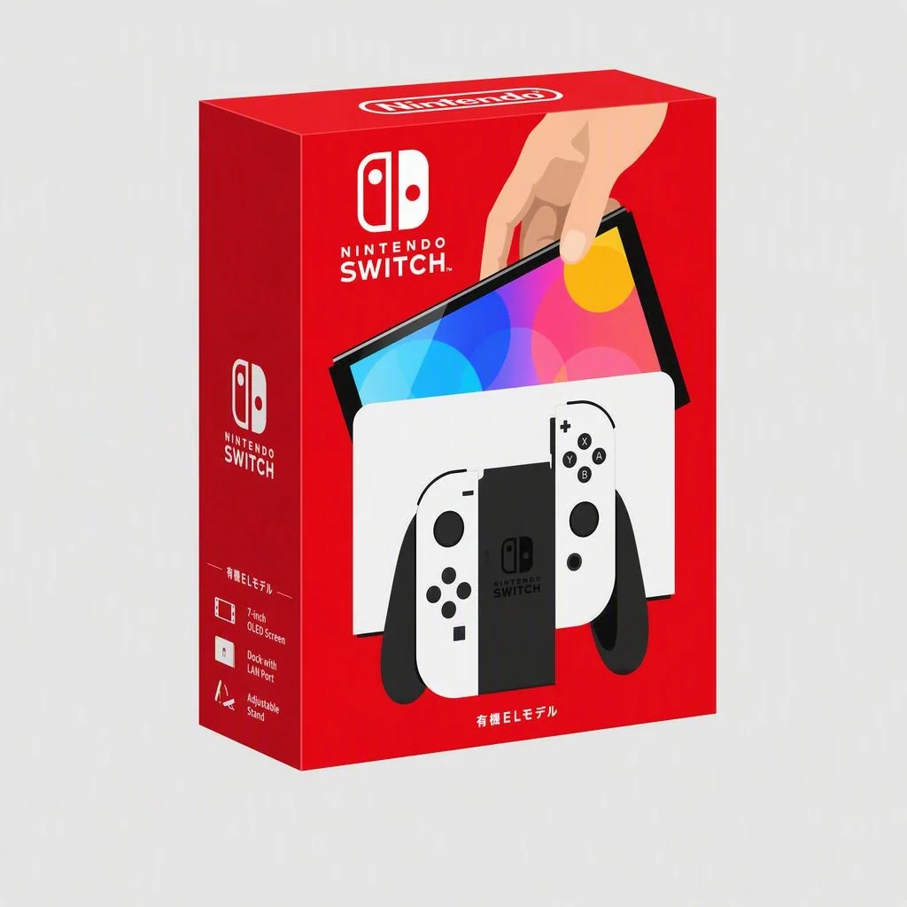

白色 Joy-Con 是 **OLED 版独占配色**，其他型号没有官方白色手柄。恰逢《银河战士：生存恐惧》同期发售，白色配色和游戏氛围契合，因此被部分玩家戏称为"银河战士限定款"。

---

## 🔴 马里奥红限定款

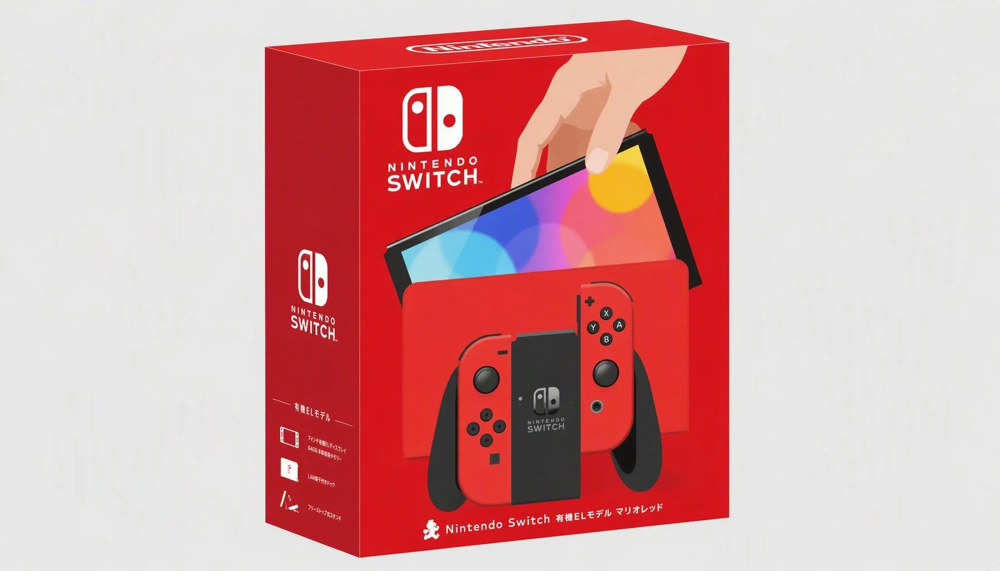

为纪念马里奥 35 周年推出的限定款。和一代续航版的马里奥限定机不同——**这款连背板都是红色的**，整体感更强。

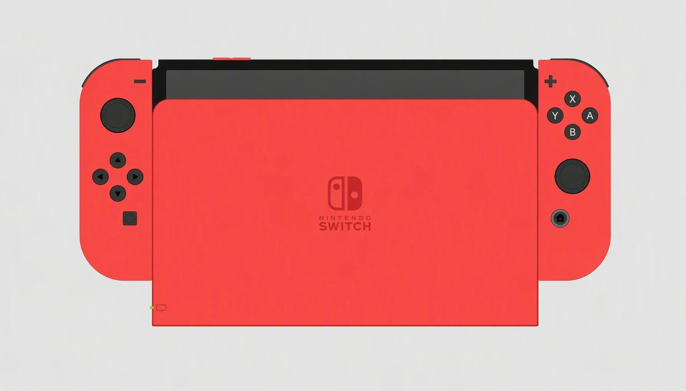

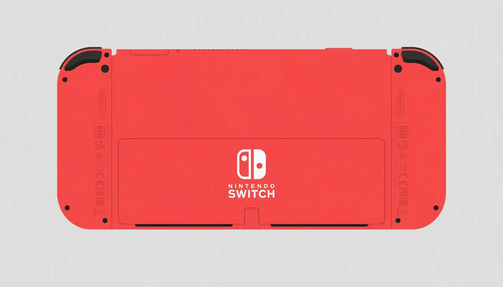

---

## 🟣🟠 宝可梦 朱/紫 联名款

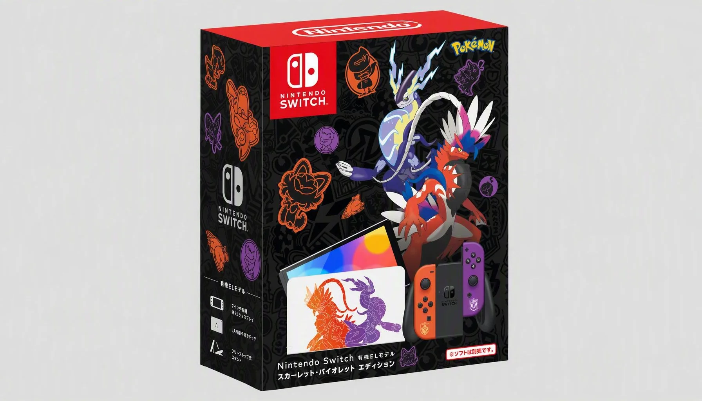

以《宝可梦 朱/紫》为主题的联名限定机，Joy-Con 分别为朱色和紫色涂装，呼应游戏双版本封面神兽。设计相当出彩，可惜游戏本身口碑两极分化，影响了这款主机的收藏热度。

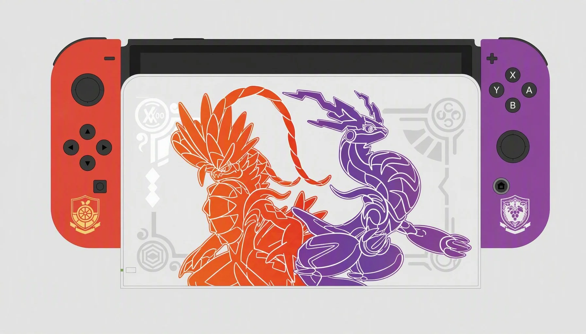

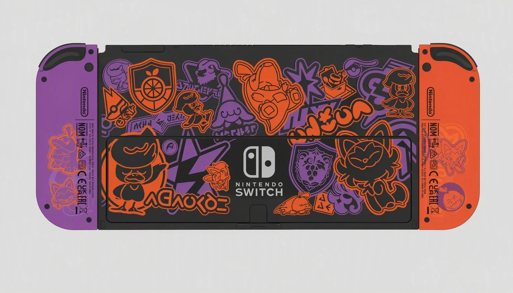

---

## 🟡🟣 Splatoon 3 限定款

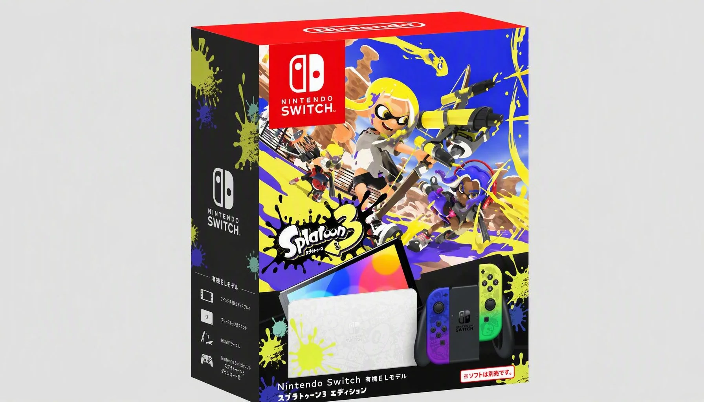

《Splatoon 3》联名限定机，**渐变色 Joy-Con** 是整个 Switch 限定机中最漂亮的设计之一。左手黄→紫渐变，右手紫→黄渐变，搭配潮牌风格的机身图案，当之无愧的年度热门款。

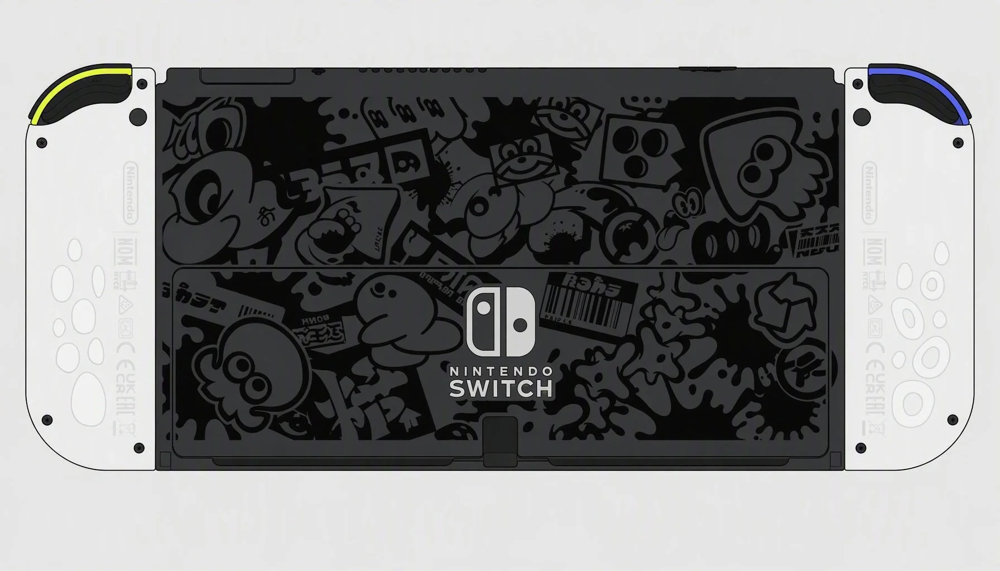

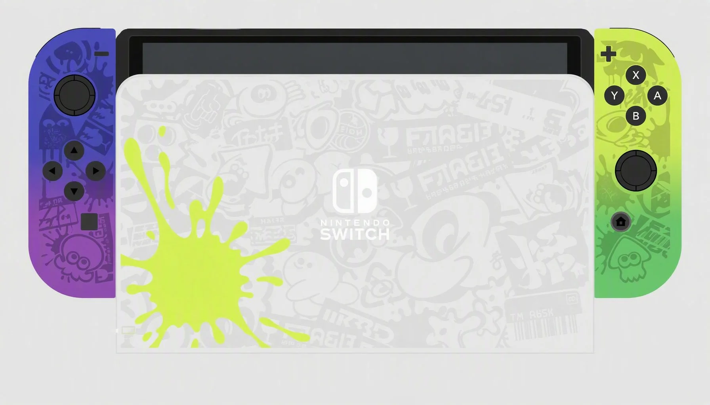

---

## 🟢 塞尔达传说 王国之泪限定款

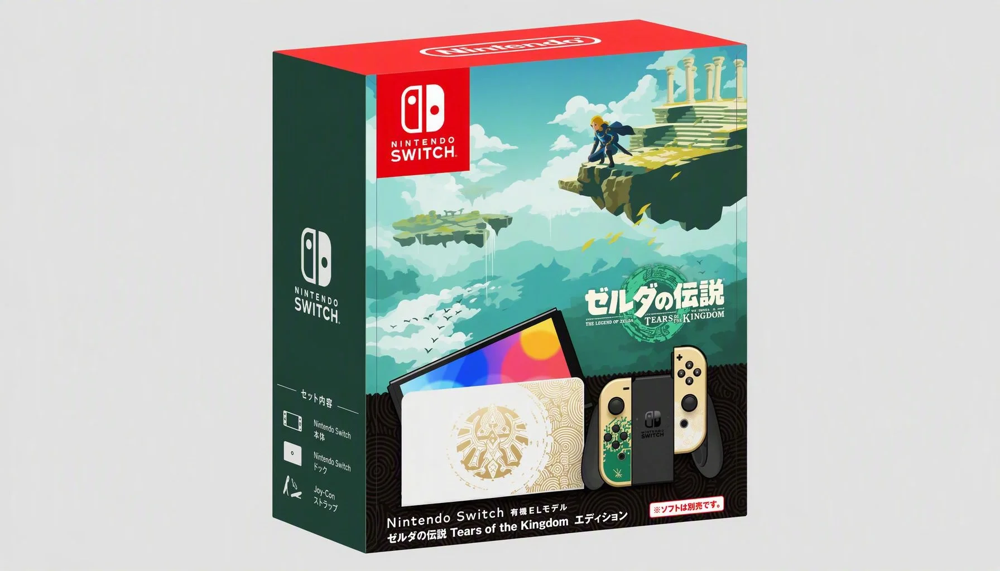

《塞尔达传说：王国之泪》联名限定机。青金色的 Joy-Con 搭配金色纹饰，设计非常高级，个人很喜欢。发售初期经历了一小波涨价，后期随货源充足价格又大幅回落。

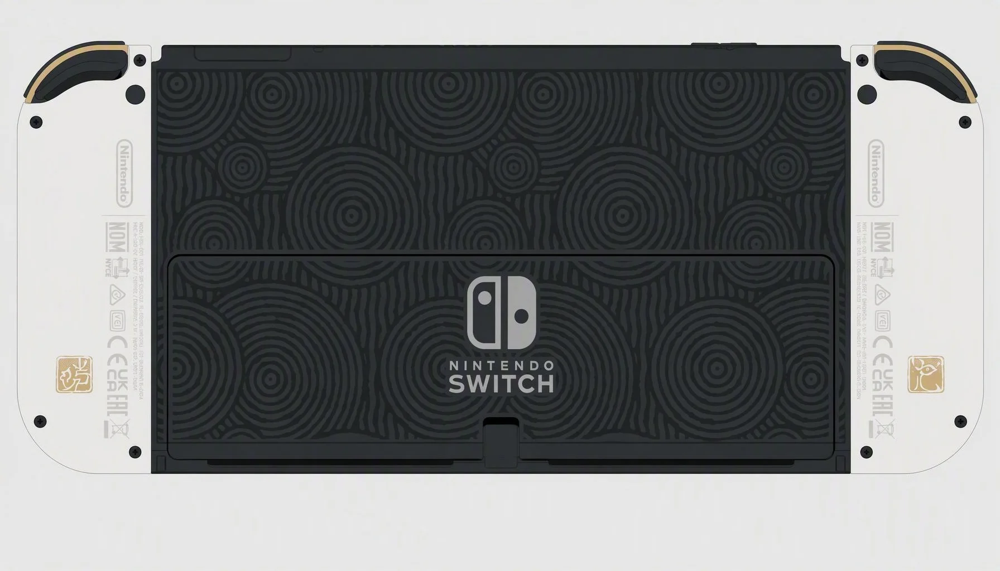

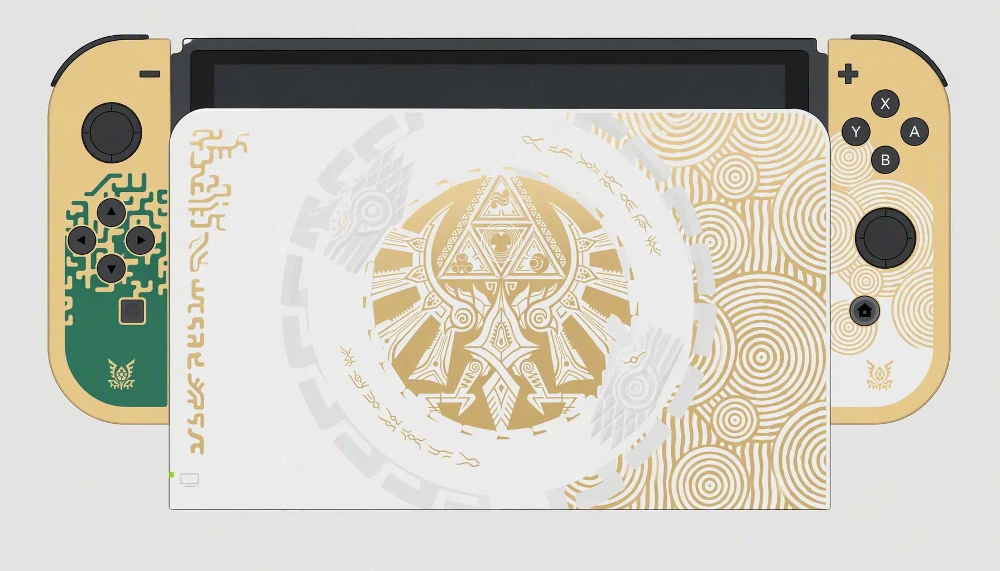

---

:::tip[💡 收藏建议]
OLED 限定机中，Splatoon 3 和王国之泪的设计评价最高。但所有限定机在 Switch 2 发售后都有一定程度的二手价格下跌，是入手收藏的好时机。
:::
