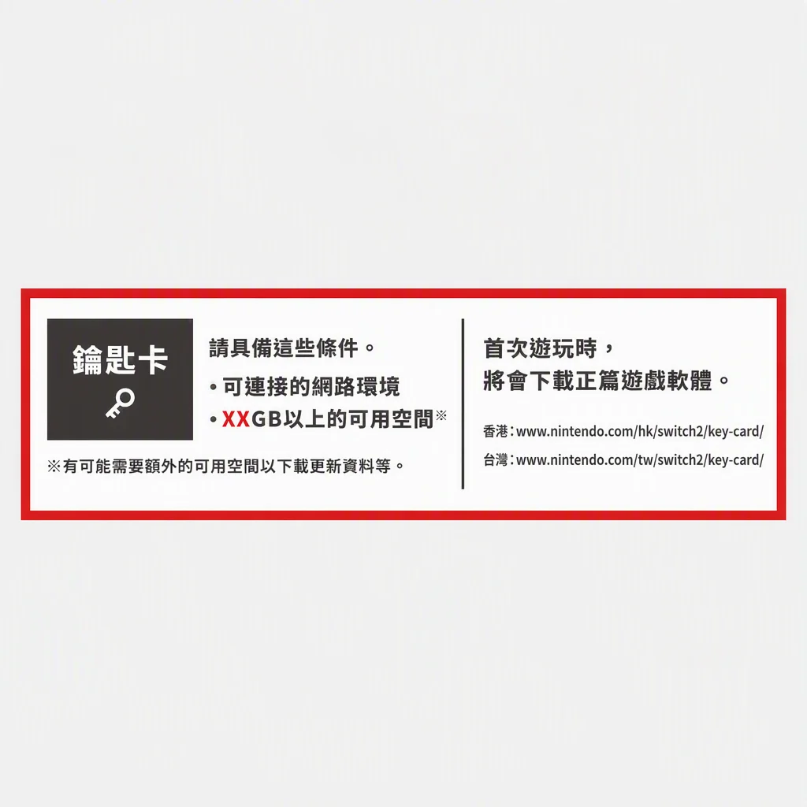

> 本文最后更新日期：2026-08-17

选购 Switch 2 时最容易踩坑的问题，集中在这里解答，会持续补充。

---

## 🛒 该买哪个版本？日版 / 港版 / 国行 / 国际版怎么选？

**Q：该买哪个版本？日版、港版、国行、国际版怎么选？**

**A：** 一句话：**首选多语言国际版（例如 港版 / 美版 / 欧版 / 国际版日版）**，系统语言可选、eShop 可自由切换区域，最省心。

- 🇭🇰 **港版 / 国际版**：推荐。语言可切换，eShop 可跨区购买，无锁区烦恼。
- 🇯🇵 **日版**：分两种——普通日版和国际版规格一致；但要警惕「日本国内専用」特供机（锁日文、锁日区商店），别贪便宜买错（见下一条）。截止今日（2026-08-17）日版国际版在日本本土都很难预约上，市面上基本没有流通。
- 🇨🇳 **国行版**：Switch 2 目前**没有国行**。任天堂至今未指定中国大陆代理商，一代国行的网络服务也已在 2026 年 5 月 15 日全面停止。市面上自称「国行 Switch 2」的都要小心。

---

## ⚠️ 为什么不推荐买日本限定版？

**Q：为什么不推荐买日本限定版？我不介意界面是日语**

**A：** 除了锁操作界面为日语以外，还会限制仅能用日语商店、以及只能和地区设定为日本的机器联机；甚至很多多语言的游戏，由于系统锁日语，进入游戏后也无法调整为日语以外的语言。

---

## 🔄 向下兼容吗？一代的卡带和数字游戏还能玩吗？

**Q：Switch 2 向下兼容吗？我一代的卡带和数字游戏还能玩吗？**

**A：** 兼容。一代的实体卡带（黑色）可以直接插进 Switch 2 游玩，eShop 里已购买的数字游戏也能重新下载，部分一代游戏还会获得性能强化（更流畅、加载更快）。

反过来不行：Switch 2 的红色卡带和 Switch 2 专属新作，一代机器**无法运行**。

---

## 🔑 什么是钥匙卡？

**Q：什么是钥匙卡？**

**A：** Switch 2 部分实体卡带是「钥匙卡」——卡带本身不含游戏数据，仅作为验证凭证，插入后仍需下载完整游戏到机身存储。可以理解为「数字版 + 实体凭证」的结合：喜欢实体收藏的玩家能拿到盒子和卡带，但游戏本体依然要占机身存储空间。

包装盒下半部分会有如下标识（如图）：

因为钥匙卡 + 数字版游戏都要占用机身存储，256GB 可能不够用，重度玩家需要额外扩容（扩容卡的选择见下一条）。

---

## 📦 256GB 存储够用吗？要不要买 microSD Express 卡？

**Q：256GB 机身存储够用吗？要不要买 microSD Express 卡？**

**A：** 大部分玩家够用，主要看你的买法：

- 🎮 **主力买实体卡带**：游戏数据大多在卡带里，256GB 很宽裕。
- 💾 **偏爱数字版 / 买了不少「钥匙卡」**：游戏要下载到机身，256GB 会吃紧。
- 💰 **microSD Express 卡**：目前价格还偏高，但是因为还会涨，所以现在反而推荐入手。

---

## 💾 为什么 Switch 2 无法读取上一代 Switch 的 microSD 储存卡？

**Q：为什么 Switch 2 无法读取上一代 Switch 的 microSD 储存卡？**

**A：** 因为 Switch 2 的卡槽只支持 **microSD Express** 这一新规格，而上一代 Switch 用的是普通 microSD（UHS-I 规格）。两种规格不兼容，旧卡插进去不会被识别。想给 Switch 2 扩容，需要另外购买 microSD Express 卡，普通 microSD 一律用不了。

---

## 🎒 需要买哪些配件？

**Q：需要额外买哪些配件？贴膜、收纳包、手柄有必要吗？**

**A：** 主机盒里已经附带了：主机、Joy-Con 2 ×2、底座、AC 适配器 + USB-C 线、Ultra High Speed HDMI 线、Joy-Con 2 腕带 ×2、Joy-Con 2 握把，这些不用另买。

额外建议按需补：

- 🛡️ **屏幕保护膜**：强烈建议，到手即贴。底座插拔长期可能划伤屏幕边缘。
- 💾 **microSD Express 卡**：按需（见上一条）。
- 🎒 **收纳包 / 便携包**：经常带出门就买。
- 🎮 **Pro 手柄 / 额外 Joy-Con 2**：多人同乐或长时间 TV 模式玩家建议。

⚠️ 注意：一代的 AC 适配器、HDMI 线、底座**不能用在 Switch 2 上**（底座插不进去、适配器供电不足无法输出画面），请务必使用随附的配件。

---

## 📺 普通电视能玩吗？需要买 4K 电视吗？

**Q：普通电视能玩吗？需要专门买 4K 电视吗？**

**A：** 有 HDMI 口的普通电视就能玩，只是享受不到最佳画质。Switch 2 底座模式最高支持 4K 60Hz（部分游戏），想跑满 4K / 120Hz / HDR 需要电视支持 HDMI 2.1。

1080p 的老电视一样能正常玩，画面只是没有 4K 那么细腻，**不需要为了 Switch 2 专门换 4K 电视**——除非你本来就打算换。掌机模式下 7.9 寸屏是 1080p 120Hz，本身就很清晰。

---

## 🌐 联机、语音聊天需要 Nintendo Switch Online 会员吗？

**Q：联机对战、语音聊天需要 Nintendo Switch Online 会员吗？**

**A：** 需要。和其他主机一样，Switch 2 的**在线联机对战需要 Nintendo Switch Online（NSO）会员**。

- 💬 **GameChat 语音聊天**：也需要 NSO 会员（之前有过免费试用期，2026 年 3 月 31 日已结束），并且需要 Nintendo Account 通过手机号短信验证。
- 📥 **下载数字游戏、更新系统**：不需要会员。
- ☁️ **云存档**：需要会员。

简单记：**不联机就无所谓，要联网对战 / 语音 / 云存档就得开会员**。

---

:::tip[💡 相关阅读]
版本选择、日版特供机的识别、钥匙卡、涨价信息等更详细内容，详见 [Nintendo Switch 2 选购指南](/switch/gen-2/guide/)。
:::
